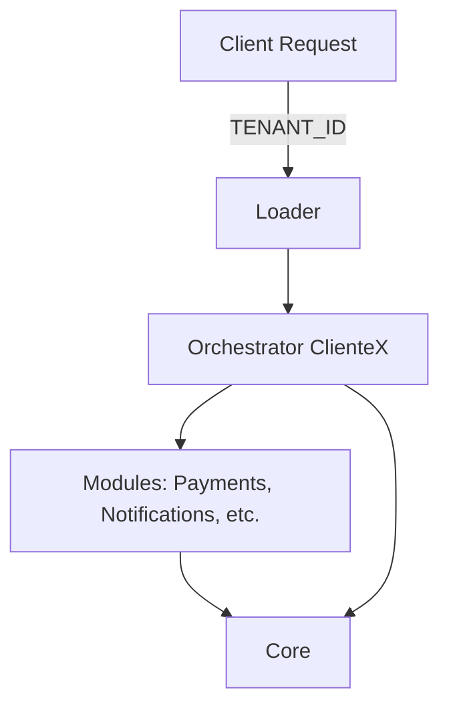

# Arquitectura MOC

La arquitectura **Modular Orchestrated Core (MOC)** se basa en la separación clara entre lógica compartida y personalización por cliente, lo cual permite escalar, mantener y evolucionar aplicaciones multi-tenant sin duplicar código.

---

## Diagrama General



Este flujo representa cómo se orquesta la carga modular según el tenant.

---

## Capas Principales

### 1. Core

* Lógica base del sistema.
* Contiene los contratos e interfaces comunes.
* No tiene conocimiento específico de ningún cliente.

### 2. Modules

* Implementaciones plug-and-play que resuelven funcionalidades reutilizables: notificaciones, pagos, auditoría, validaciones, etc.
* Configurables desde los orquestadores.

### 3. Orchestrators

* Cada cliente tiene un archivo que configura cómo debe comportarse el sistema para ese tenant.
* Define qué módulos usar y cómo parametrizarlos.

```csharp
// ClienteA.Orchestrator.cs
public override void Configure()
{
    UseModule<PaymentsModule>(config => config.UseCurrency("USD"));
    UseModule<NotificationsModule>(config => config.WithProvider("Twilio"));
}
```

### 4. Loader

* Carga el orchestrator correspondiente usando la variable de entorno `TENANT_ID`.
* Inyecta configuraciones y arranca la aplicación con la composición correcta.

---

## Comparación con otros enfoques

| Enfoque                             | Ventajas MOC                   | Desventajas de otros enfoques                |
| ----------------------------------- | ------------------------------ | -------------------------------------------- |
| Monolito por cliente                | Evita duplicación              | Duplicación de código y esfuerzo             |
| Feature flags                       | Modularización clara           | Acoplamiento, lógica condicional compleja    |
| Microservicios aislados por cliente | Centralización y reutilización | Fragmentación extrema, difícil mantenimiento |

---

## Relación con patrones de diseño

* **Bridge**: separa abstracción (core) de implementación (módulos), permitiendo cambiar ambos de forma independiente.
* **Strategy**: cada tenant puede cambiar comportamientos a través del orquestador.
* **Plugin**: módulos actúan como plugins intercambiables.

---

## Consideraciones Técnicas

* El core debe ser completamente desacoplado de la lógica por cliente.
* Los módulos deben exponer interfaces claras.
* La configuración debe estar desacoplada del ciclo de vida de la app.
* Es fundamental usar pruebas unitarias y de integración por orchestrator.
